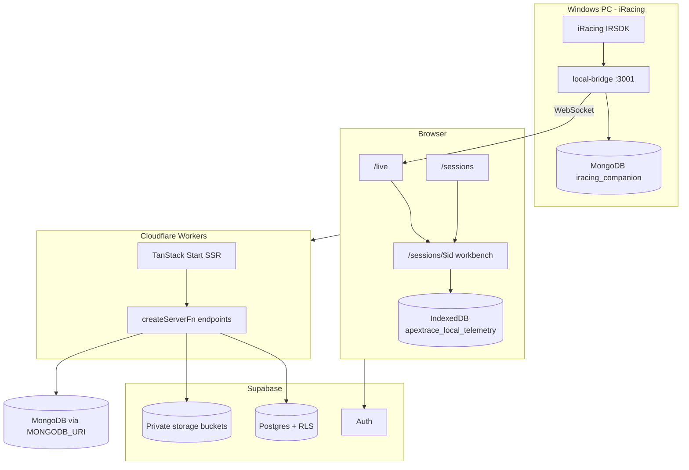

# Pit Wall — Current State Audit

**Audit date:** 2026-05-19  
**Repository:** [iRacing-Companion](.)  
**Live deployment:** [https://iracing-companion.lovable.app](https://iracing-companion.lovable.app)

This document is the authoritative snapshot of what is shipped, what is code-complete but not integrated, and what risks block production rollout. For planned work, see [ROADMAP.md](ROADMAP.md).

---

## 1. Executive summary

**Pit Wall** (also branded **ApexTrace** in parts of the UI) is an iRacing companion with two main modes:

1. **Live telemetry** — real-time dashboard fed by a local Windows bridge over WebSocket (`ws://<pc>:3001`).
2. **Lap workbench** — MoTeC-style analysis of `.ibt` files parsed in-browser via a Web Worker, plus playback of browser-recorded `.pwlap` sessions.

The core product is **production-usable** for cloud users on Lovable (Supabase + Cloudflare Workers): auth, session upload, workbench, live coach, sharing, community, fingerprinting, and admin roles all exist and are wired.

**MongoDB + `.pwlap` export/import pipeline** is now fully integrated on the UI side, verified, and compiling cleanly. Server functions and the desktop bridge are ready, and signing/import/export components are fully wired in.

| Category | Status |
| --- | --- |
| Live dashboard + bridge | Shipped |
| `.ibt` workbench | Shipped |
| AI coach / advisor / TTS | Shipped (cloud AI gateway) |
| Community + themes + sharing | Shipped |
| Local/offline dev mode | Shipped (partial; mock auth limits some server paths) |
| Bridge → MongoDB capture | Code complete; configurable `RECORD_HZ`, requires `MONGODB_URI` on bridge |
| `.pwlap` export/import (server) | Code complete; not deployed |
| `.pwlap` UI (Export/Import dialogs) | Shipped; fully wired in sessions list and workbench header |
| Automated tests | **None** |
| Stripe billing | Placeholders only |

---

## 2. Product identity

Naming is inconsistent across routes, storage keys, and copy:

| Context | Brand used |
| --- | --- |
| Landing, `/live`, `__root.tsx` meta, Help system | **Pit Wall** |
| `/sessions`, `/auth`, `/share`, lab, OG share API | **ApexTrace** |
| `LocalDbSettings`, IndexedDB DB name | **ApexTrace** / `apextrace_local_telemetry` |
| Local auth session key | `apex_local_session` |
| Package name | `iracing-companion` |

**Recommendation:** pick one public name (README uses Pit Wall) and align page titles, OG tags, and local-mode copy in a single pass (see ROADMAP audit backlog P1).

---

## 3. Architecture

### 3.1 High-level diagram



### 3.2 Runtime modes

| Mode | How activated | Data store | Auth |
| --- | --- | --- | --- |
| **Cloud (default)** | `VITE_SUPABASE_*` set | Supabase Postgres + Storage | Supabase email/OAuth |
| **Local developer** | "Continue as Local Developer" or missing Supabase env | MongoDB `iracing` (via proxy) + IndexedDB blobs | `mock-local-token` |
| **Bridge-only PWA** | Open `http://localhost:3001` on bridge PC | Bridge lap cache | None |

### 3.3 Tech stack

| Layer | Technology |
| --- | --- |
| Framework | TanStack Start v1, React 19, Vite 7 |
| Deploy target | Cloudflare Workers (`wrangler.jsonc`, `src/server.ts`) |
| Styling | Tailwind CSS v4, shadcn/ui, oklch tokens in `src/styles.css` |
| Charts | uPlot, custom Canvas/SVG, Three.js replay |
| Backend DB | Supabase Postgres + RLS |
| Optional telemetry DB | MongoDB (`iracing_companion` on server/bridge; `iracing` in `db.local.ts`) |
| AI | Lovable AI Gateway (Gemini / GPT via server functions) |
| Parser | Custom IRSDK `.ibt` parser in Web Worker |

---

## 4. Feature inventory

Legend: **Shipped** = wired in UI and usable end-to-end. **Partial** = code exists, integration or ops incomplete. **Stub** = placeholder only.

### 4.1 Routes

| Route | File | Status | Notes |
| --- | --- | --- | --- |
| `/` | `src/routes/index.tsx` | Shipped | Marketing / landing |
| `/how-it-works` | `src/routes/how-it-works.tsx` | Shipped | Parser explainer |
| `/auth` | `src/routes/auth.tsx` | Shipped | Email + Google OAuth |
| `/live` | `src/routes/live.tsx` | Shipped | Layout recently optimized (flex grid) |
| `/sessions` | `src/routes/sessions.index.tsx` | Shipped | `.ibt` upload; displays `.pwlap` names; **no Import button** |
| `/sessions/$id` | `src/routes/sessions.$id.tsx` | Shipped | Full workbench; `.ibt` + in-browser `.pwlap`; **no Export dialog** |
| `/fingerprint` | `src/routes/fingerprint.tsx` | Shipped | Local lapfolder scan |
| `/share/$token` | `src/routes/share.$token.tsx` | Shipped | Read-only shared lap |
| `/lab/lapfile` | `src/routes/lab.lapfile.tsx` | Shipped | Parser playground |
| `/roadmap` | `src/routes/roadmap.tsx` | Shipped | UI roadmap (phases 1–5); may overstate `.pwlap` export MVP |
| `/admin` | `src/routes/admin.tsx` | Shipped | Role management (`admin`, `beta_tester`) |
| `/sitemap.xml` | `src/routes/sitemap[.]xml.ts` | Shipped | SEO |
| `/api/public/og/share.$token` | `src/routes/api/public/og/share.$token.ts` | Shipped | OG image for shares |

Global **BackButton** on non-landing pages (`src/components/BackButton.tsx`).

### 4.2 Live telemetry (`/live`)

| Feature | Component / module | Status |
| --- | --- | --- |
| WebSocket telemetry | `useTelemetry.ts` (port **3001**) | Shipped |
| Bridge install / spawn | `BridgeInstall.tsx`, `bridge.functions.ts` | Shipped |
| Configurable channel list | `ConfigurableChannelList.tsx`, `ChannelRegistry.ts` | Shipped |
| MoTeC-style panels | `MotecPanels.tsx` | Shipped |
| Derived metrics | `DerivedMetrics.tsx` | Shipped |
| Live reference overlay | `LiveReference.tsx` | Shipped |
| Recording buffer | `RecordingControls.tsx`, `liveRecorder.ts` | Shipped |
| Desktop lap sync | `DesktopLapSync.tsx` | Shipped |
| AI live coach | `LiveCoach.tsx`, `coachRules.ts` | Shipped |
| Setup advisor button | `AdvisorButton.tsx` | Shipped |
| Gear advisor | `GearAdvisor.tsx` | Shipped |
| Fingerprint upload | `FingerprintUploadCard.tsx` | Shipped |
| Bridge → MongoDB recorder | `desktop/bridge/telemetry-recorder.js` | Partial — needs `MONGODB_URI` on bridge |

### 4.3 Workbench (`/sessions/$id`)

| Pane | Component | Status |
| --- | --- | --- |
| Channel browser | `ChannelBrowser.tsx` | Shipped |
| Stacked traces | `StackedTraces.tsx` | Shipped |
| Track map | `TrackMap.tsx` | Shipped |
| Lap list / timeline | `LapList.tsx`, `Timeline.tsx` | Shipped |
| Sector spider | `SectorSpider.tsx` | Shipped |
| Time loss waterfall | `TimeLossWaterfall.tsx` | Shipped |
| G-G diagram | `GGDiagram.tsx` | Shipped (eager mount — perf concern) |
| Optimal lap | `OptimalLap.tsx` | Shipped |
| Setup sheet / diff | `SetupSheet.tsx`, `SetupDiff.tsx` | Shipped |
| 3D replay | `ReplayThree.tsx`, `CinemaPlayback.tsx` | Shipped (eager mount) |
| AI coach / counterfactuals | `AICoach.tsx`, `Counterfactuals.tsx` | Shipped |
| Share / CSV export | `ShareButton.tsx`, `ExportButton.tsx` | Shipped |
| Fingerprint delta | `FingerprintDelta.tsx` | Shipped |
| **Export .pwlap dialog** | `ExportPwlapDialog.tsx` | **Not wired** |
| **Import .pwlap** | `ImportPwlapButton.tsx` | **Not wired** (sessions list) |

### 4.4 Server functions (`src/lib/*.functions.ts`)

| Module | Purpose | Status |
| --- | --- | --- |
| `coach.functions.ts` | Per-lap AI critique | Shipped |
| `advisor.functions.ts` | Setup recommendations | Shipped |
| `tts.functions.ts` | Spoken coach | Shipped |
| `history.functions.ts` | Session CRUD | Shipped |
| `share.functions.ts` | Share tokens | Shipped |
| `community.functions.ts` | Gear ratios, layouts, votes | Shipped |
| `fingerprint.functions.ts` | Driver fingerprint | Shipped |
| `preferences.functions.ts` | User prefs / layouts | Shipped |
| `themes.functions.ts` | Custom themes | Shipped |
| `setup.functions.ts` | Setup helpers | Shipped |
| `bridge.functions.ts` | Start bridge, status | Shipped |
| `liveLaps.functions.ts` | Live lap → sessions | Shipped |
| `admin.functions.ts` | User roles | Shipped |
| `localDb.functions.ts` | Local Mongo session proxy | Shipped (local mode) |
| `pwlap.functions.ts` | Export/import `.pwlap` | Partial — needs infra + UI |

### 4.5 AI, community, monetization

| Area | Status |
| --- | --- |
| LLM coach / advisor | Shipped via authenticated server functions |
| Multi-provider client (`llm.ts`) | Shipped for configurable endpoints |
| Community voting | Shipped; votes via SECURITY DEFINER RPC |
| Themes | Shipped; `shared_themes` SELECT is authenticated-only |
| Billing (`billing.client.ts`) | **Stub** — mock Stripe URLs |
| Admin / beta roles | Shipped (`user_roles` migration) |

---

## 5. Data model

### 5.1 Supabase (Postgres)

**Migrations** (9 files under `supabase/migrations/`):

| Migration | Contents |
| --- | --- |
| `20260517185153_*` | `live_lap_records` |
| `20260517190631_*` | `driver_fingerprint`, `telemetry_sessions.fingerprint_delta` |
| `20260517210805_*` | Community tables (`shared_gear_ratios`, `shared_channel_layouts`, `shared_car_classes`, `community_votes`) |
| `20260517213124_*` / `20260517213146_*` | Vote protection triggers + `set_community_votes` RPC |
| `20260518163139_*` / `20260518163152_*` | Additional schema (themes, sessions extensions) |
| `20260518_user_roles.sql` | `user_roles` + `has_role()` pattern |
| `20260519_pwlap_tables.sql` | **`user_signing_keys`, `pwlap_imports`, `pwlap_exports`** — **not applied in production** (untracked in git at audit time) |

Core user tables (from generated types / README): `telemetry_sessions`, laps/storage paths, `driver_fingerprint`, preferences, themes, community artifacts, `live_lap_records`, share tokens.

**Not in any migration:** `live_coach_events` (referenced in ROADMAP only).

### 5.2 MongoDB

Two connection paths with **different database names**:

| Client | Database | Collections | Used by |
| --- | --- | --- | --- |
| `src/lib/mongodb.server.ts` | `iracing_companion` | `telemetry_samples`, `channels_manifest`, `laps`, `sessions` | `pwlap.functions.ts`, bridge export path |
| `src/lib/db.local.ts` | `iracing` | Local session documents | Local developer mode proxy |
| `desktop/bridge/telemetry-recorder.js` | `iracing_companion` | Same as server | Bridge live capture |

Bridge sampling/stream/record rates are configurable (`TICK_HZ`, `UI_HZ`, `RECORD_HZ`) with optional adaptive UI fallback to 30Hz.

### 5.3 Browser storage

| Store | Key / name | Purpose |
| --- | --- | --- |
| IndexedDB | `apextrace_local_telemetry` / `blobs` | Local `.ibt`/telemetry file cache |
| localStorage | `apex_local_session` | Local developer mode flag |
| Supabase auth | default | Cloud session tokens |

---

## 6. Bridge and telemetry paths

### 6.1 Desktop bridge (`desktop/bridge/`)

- **Port:** 3001 (HTTP + WebSocket + optional PWA at `public/`)
- **Dependencies:** `irsdk-node`, `ws`, `mongodb`
- **Entry:** `server.js` — IRSDK loop, WebSocket broadcast, lap cache, `TelemetryRecorder` when `MONGODB_URI` set
- **Recorder:** `telemetry-recorder.js` — configurable sample/record rates, per-second aggregation, lap metadata

### 6.2 Browser connection

- `src/lib/useTelemetry.ts` — `WS_PORT = 3001`
- `BridgeInstall` can spawn bridge via `startBridge()` server function (currently launches `local-bridge`)
- `DesktopLapSync` polls bridge for completed laps

### 6.3 Live recording (browser `.pwlap`)

- `liveRecorder.ts` — in-browser recording format consumed by workbench via `pwlap/adapter`
- Distinct from **server export** `.pwlap` (MongoDB-backed, encrypted/signed)

---

## 7. `.ibt` parser pipeline

| Step | Location |
| --- | --- |
| Upload | `uploadIbt.ts` → Supabase Storage (RLS) |
| Parse | `parser.worker.ts` via `parseInWorker.ts` |
| Lap detection | `Lap` channel |
| Track outline | VelocityX/Y × Yaw integration |
| Render | uPlot + shared cursor across panes |

**Performance notes (from ROADMAP):** endurance `.ibt` files can exceed 200MB; all heavy panes mount on session load; no automated golden-file tests.

---

## 8. `.pwlap` format and export/import

### 8.1 Library (`src/lib/pwlap/`)

| File | Role |
| --- | --- |
| `types.ts` | Format constants, `PwlapContent`, flags |
| `format.ts` | 256-byte header |
| `encrypt.ts` | AES-256-GCM + PBKDF2 |
| `sign.ts` | Ed25519 (SubtleCrypto; tweetnacl fallback **not installed**) |
| `serialize.ts` | Compress → sign → encrypt pipeline |
| `adapter.ts` | Workbench playback from browser recordings |

**Compression:** tries global `zstd`, then `pako` — **neither is in `package.json`**; may export with `COMPRESSED` flag set but uncompressed body.

### 8.2 Server functions (`pwlap.functions.ts`)

| Function | Behavior |
| --- | --- |
| `exportSessionAsPwlap` | Loads session from Supabase; samples from MongoDB if `full`; uploads to `pwlap_exports` bucket; returns 7-day signed URL |
| `importPwlapSession` | Creates `telemetry_sessions` row; writes samples/laps/manifest to MongoDB; audit row in `pwlap_imports` |
| `validatePwlapFile` | Deserialize without import |

**Gaps:**

- `setup: {}` placeholder in export
- `verifySignature` on import defaults false; no public-key distribution story
- `user_signing_keys.private_key` stored server-side — **security concern**
- Import continues if MongoDB fails (warning only)
- Storage bucket `pwlap_exports` and migration **must exist** before export works

### 8.3 UI (not integrated)

- `ExportPwlapDialog.tsx` — granularity, encrypt, sign options
- `ImportPwlapButton.tsx` — file picker + password prompt

Neither is imported in `sessions.$id.tsx` or `sessions.index.tsx` (only `ShareButton` is in workbench header).

---

## 9. Auth and security

| Mechanism | Implementation |
| --- | --- |
| Cloud auth | Supabase; bearer attached in `src/start.ts` via `attachSupabaseAuth` |
| CSRF | `createCsrfMiddleware` on all server functions |
| RLS | All user tables scoped to `auth.uid()` |
| Roles | `user_roles` + `has_role()` — not on profiles |
| Local mock | `mock-local-token` → dummy Supabase client; many cloud-only functions return empty data |
| Community votes | Direct `votes` UPDATE blocked; `set_community_votes` RPC only |
| Public API | `src/routes/api/public/*` — signature verification before writes |

**Gaps:** no rate limits on community publish; no `live_coach_events`; signing keys in DB; local mode does not exercise real `pwlap` export against Supabase admin client meaningfully.

---

## 10. Deployment and operations

### 10.1 Environments

| Target | Config |
| --- | --- |
| Production | Lovable → Cloudflare Workers + Supabase |
| Local dev | `npm run dev` / `bun run dev` (Vite) |
| Bridge | `cd local-bridge && npm start` |

### 10.2 Environment variables (names only — no values)

| Variable | Used for |
| --- | --- |
| `VITE_SUPABASE_URL`, `VITE_SUPABASE_PUBLISHABLE_KEY` | Browser client |
| `SUPABASE_URL`, `SUPABASE_PUBLISHABLE_KEY`, service role (server) | Server functions |
| `MONGODB_URI` | Bridge recorder + `pwlap.functions.ts` / `mongodb.server.ts` |

### 10.3 CI (`.github/workflows/build.yml`)

- Trigger: all branches push/PR
- Steps: `bun install --frozen-lockfile`, `bun run build` with placeholder `VITE_*`
- **Does not run:** `lint`, dedicated `tsc`, tests

### 10.4 Package scripts

```json
"dev", "build", "build:dev", "preview", "lint", "format"
```

No `test` script. **Zero** `*.test.*` / `*.spec.*` files in repo.

---

## 11. Documentation map

| Document | Purpose | Freshness |
| --- | --- | --- |
| [README.md](README.md) | Primary product + structure reference | Good; includes local MongoDB mode |
| [ROADMAP.md](ROADMAP.md) | Strategic horizons + audit backlog | Updated with this audit |
| [GETTING_STARTED.md](GETTING_STARTED.md) | Bridge + app install | New (May 2026); overlaps deployment guide |
| [DEPLOYMENT_GUIDE.md](DEPLOYMENT_GUIDE.md) | PWLAP MVP deploy steps | New; operational focus |
| [IMPLEMENTATION_CHECKLIST.md](IMPLEMENTATION_CHECKLIST.md) | Phase 1–5 checklist | New; tracks PWLAP integration gaps |
| [desktop/bridge/README.md](desktop/bridge/README.md) | Bridge quick start | Good; port 3001 |
| [src/routes/roadmap.tsx](src/routes/roadmap.tsx) | Public UI roadmap | May overstate PWLAP export vs this audit |

**Stale reference:** ROADMAP item #4 previously cited port **8182**; bridge uses **3001** (corrected in ROADMAP).

---

## 12. Risk register

| ID | Risk | Severity | Mitigation |
| --- | --- | --- | --- |
| R1 | PWLAP UI/infra not wired | High | ROADMAP P0 backlog |
| R2 | `pako` / `tweetnacl` missing — silent compression/sign failure | High | Add deps; fail loud in `serialize.ts` |
| R3 | `private_key` in `user_signing_keys` | High | Client-only keys; public key in DB only |
| R4 | MongoDB DB name split (`iracing` vs `iracing_companion`) | Medium | Unify or document bridge vs local paths |
| R5 | No automated tests | Medium | Golden `.ibt` fixtures (ROADMAP cross-cutting) |
| R6 | Branding split Pit Wall / ApexTrace | Low | Copy pass |
| R7 | `live_coach_events` missing | Medium | Migration when coach quality work starts |
| R8 | All workbench panes eager-mount | Medium | ROADMAP #3 lazy tabs |
| R9 | Billing stubs | Low | Phase 4 in UI roadmap |
| R10 | `.env` modified locally — must not commit secrets | High | Gitignore / pre-commit discipline |

---

## 13. Git working tree (audit snapshot)

```
 M .env
 M src/lib/pwlap.functions.ts
 M src/routes/live.tsx
?? DEPLOYMENT_GUIDE.md
?? GETTING_STARTED.md
?? IMPLEMENTATION_CHECKLIST.md
?? src/components/ImportPwlapButton.tsx
?? src/components/workbench/ExportPwlapDialog.tsx
?? src/lib/mongodb.server.ts
?? supabase/migrations/20260519_pwlap_tables.sql
```

**Do not commit `.env`.** Untracked PWLAP files should be added when the feature ships.

---

## 14. Appendix

### 14.1 Key dependencies (`package.json`)

Runtime highlights: TanStack Start/Router/Query, Supabase JS, MongoDB driver, uPlot, Three.js, Radix/shadcn stack, Zod, Zustand, Cloudflare Vite plugin.

**Not declared:** `pako`, `tweetnacl`, `zstd-codec` (used optionally in PWLAP serialize).

### 14.2 Project structure (abbreviated)

```
src/routes/          # 14 route files
src/components/live/ # Live dashboard widgets
src/components/workbench/
src/lib/ibt/         # .ibt parser + worker
src/lib/pwlap/       # .pwlap format
src/lib/*.functions.ts
desktop/bridge/      # Local IRSDK bridge
supabase/migrations/
local-bridge/        # Primary downloadable bridge package
```

### 14.3 Related links

- Live app: https://iracing-companion.lovable.app
- Bridge default: http://localhost:3001
- Strategic roadmap: [ROADMAP.md](ROADMAP.md)

---

*This audit should be refreshed when PWLAP MVP ships or after major schema changes.*
