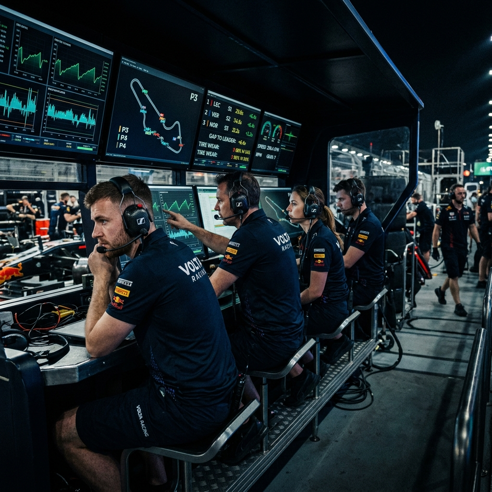

# Pit Wall — iRacing Telemetry & Lap Analysis

> Live iRacing telemetry dashboard **+** MoTeC‑style `.ibt` lap analysis workbench, in the browser and on the desktop.  
> Telemetry on track. Analysis off track. One app.

**Live:** [https://iracing-companion.lovable.app](https://iracing-companion.lovable.app)



---

## Table of Contents

1. [What this is](#what-this-is)
2. [Tech stack](#tech-stack)
3. [Feature map](#feature-map)
4. [Live telemetry (on track)](#live-telemetry-on-track)
5. [Lap analysis workbench (off track)](#lap-analysis-workbench-off-track)
6. [AI Coach & Advisor](#ai-coach--advisor)
7. [Voice & Audio](#voice--audio)
8. [Licensing & Admin](#licensing--admin)
9. [Desktop App](#desktop-app)
10. [Sessions, sharing & history](#sessions-sharing--history)
11. [Backend, auth & security](#backend-auth--security)
12. [Project structure](#project-structure)
13. [Running locally](#running-locally)
14. [Local AI (offline mode)](#local-ai-offline-mode)
15. [Credits](#credits)

---

## What this is

Pit Wall is a two‑sided iRacing companion:

- **Live mode** streams real‑time telemetry from a local bridge running alongside iRacing at **60Hz** and renders a configurable dashboard (gauges, channel readouts, derived math channels, a spoken AI race engineer).
- **Workbench mode** parses native iRacing `.ibt` telemetry files **directly in the browser** (Web Worker) and gives you a MoTeC‑style analysis environment: stacked traces, track map, sector spider, G–G diagram, lap compare, optimal lap, time‑loss waterfall, setup sheet, replay, and AI counterfactuals.
- **Desktop App** wraps both modes in an Electron shell that auto‑spawns the bridge, persists window state, and routes audio to any output device.

---

## Tech stack

| Layer | Technology |
|---|---|
| Framework | TanStack Start v1 (React 19, SSR, file‑based routing) on Vite 7 |
| Runtime | Cloudflare Workers (edge) for server functions & API routes |
| Styling | Tailwind CSS v4 with `oklch` design tokens in `src/styles.css` |
| UI | shadcn/ui (Radix primitives) + lucide-react icons |
| Charts | uPlot (synchronized stacked traces), custom Canvas/SVG (track map, G–G, spider) |
| State | TanStack Query + Zustand (persisted to localStorage) |
| Backend | Supabase (Postgres + Auth + Storage + Realtime) via Lovable Cloud |
| AI | Lovable AI Gateway (Gemini 2.5 Pro) · local LLM via OpenAI-compatible API |
| TTS | ElevenLabs (server‑side) with per-user output device routing |
| Desktop | Electron 31 + auto-bridge-sync |
| Parser | Custom `.ibt` binary parser in a Web Worker — typed arrays for 250+ channels |

---

## Feature map

| Area | Route | Highlights |
|---|---|---|
| Landing | `/` | Hero image, feature overview, OG image, schema.org |
| How it works | `/how-it-works` | Architecture, parsing pipeline |
| Auth | `/auth` | Email/password, Google OAuth, email verification |
| Live dashboard | `/live` | 60Hz telemetry, gauges, AI coach, voice radio, bridge install |
| Settings | `/settings` | AI provider, ElevenLabs, output device, microphone, Local LLM |
| Workbench | `/sessions/$id` | Full lap analysis for an uploaded `.ibt` |
| Sessions list | `/sessions` | All uploaded laps, fingerprint deltas |
| Car fingerprint | `/fingerprint` | Tire/brake/aero fingerprint vs reference |
| Shared lap | `/share/$token` | Public read-only view of a lap |
| Lab | `/lab/lapfile` | Parser diagnostic playground |
| Admin | `/admin` | Key generation, licence management (owner only) |
| Roadmap | `/roadmap` | Public feature roadmap |
| Sitemap | `/sitemap.xml` | SEO sitemap |

---

## Live telemetry (on track)

Route: **`/live`** · Components: `src/components/live/*`

### Bridge

The local bridge (`local-bridge/server.js`) runs on your Windows sim PC and reads iRacing's Shared Memory API via `irsdk-node`.

- Sends a **`Telemetry`** JSON packet at **60Hz** over WebSocket (`ws://localhost:3001`)
- Broadcasts to all connected clients simultaneously (browser, phone, desktop app)
- Falls back gracefully when iRacing is closed — clients show a "Disconnected" state
- Auto-reconnects every 3 seconds on the client side

**Bridge extras** — every packet now includes a rich `extras` block with high-fidelity channels the AI uses:

| Channel | SDK Key | Units |
|---|---|---|
| Yaw rate | `YawRate` | rad/s |
| Shock deflection ×4 | `LFshockDefl` etc. | m |
| Brake line pressure ×4 | `LFbrakeLinePress` etc. | Pa |
| Wheel speed ×4 | `LFwheelSpeed` etc. | rad/s |
| Pitch / Roll / rates | `Pitch`, `Roll` etc. | rad, rad/s |
| Tyre lateral force | `LFtireForceLatN` etc. | N |
| Velocity XYZ | `VelocityX/Y/Z` | m/s |

### Dashboard widgets

- **`ConfigurableChannelList.tsx`** — Pick any live IRSDK channel, lay them out as compact readouts. Layout persisted per user.
- **`DerivedMetrics.tsx`** — Computed channels (delta to ref, brake bias %, slip estimates, ideal gear).
- **`LapMetricsTable.tsx`** — Rolling 60-sample (last 1s @ 60Hz) table of live lap metrics.
- **`LiveCoach.tsx`** — Per-lap spoken radio calls via ElevenLabs, routed to the user's chosen audio output device.
- **`AdvisorButton.tsx`** — On-demand setup/driving style tips from the AI, including bridge extras data.
- **`LiveStrategy.tsx`** — Real-time strategy copilot (gaps, pit windows, tyre windows).
- **`BridgeInstall.tsx`** — Step-by-step bridge setup instructions shown when not connected.

### Workspaces (tiers)

Three workspace presets are available, lockable behind licence tiers:

| Workspace | Key | Focus |
|---|---|---|
| iRacing Lite Workbook v1.2 | `lite` | Core telemetry channels |
| iRacing Plus Workbook v1.3 | `plus` | Extended channels + math |
| iRacing Plus Real-Time Telemetry v1.0 | `realtime` | Full 60Hz real-time channels |

The active workspace and its enabled math channel definitions are injected into every AI prompt automatically.

---

## Lap analysis workbench (off track)

Route: **`/sessions/$id`** · Components: `src/components/workbench/*`

### Parsing pipeline (`src/lib/ibt/`)

1. **Upload** `.ibt` → stored privately (RLS-scoped) via `uploadIbt.ts`
2. **Decode header** — IRSDK header, variable headers, embedded session YAML (`parser.ts`)
3. **Stream samples** in a dedicated **Web Worker** (`parser.worker.ts`) — 250+ channels decoded into `Float32Array`s without blocking the UI
4. **Reconstruct** lap boundaries from the `Lap` channel; rebuild track outline from `VelocityX/Y × Yaw`
5. **Render** with uPlot + a single shared sub-frame cursor across every pane

### Analysis panes

| Component | What it does |
|---|---|
| `ChannelBrowser.tsx` | 250+ channels grouped and searchable, click-to-plot |
| `StackedTraces.tsx` | Synchronized uPlot panels with min/max/avg readout |
| `TrackMap.tsx` | Reconstructed XY outline, live cursor dot, sector overlay |
| `Timeline.tsx` + `LapList.tsx` | Reference lap + compare lap (dashed overlay) |
| `SectorSpider.tsx` | Per-sector deltas vs reference as radar chart |
| `TimeLossWaterfall.tsx` | Where time was lost/gained across a lap |
| `GGDiagram.tsx` | Longitudinal × lateral G scatter with envelope |
| `MinCornerSpeed.tsx` | Apex speed per corner, deltas vs reference |
| `BrakeBias.tsx` | Brake-bias analysis over a stint |
| `OptimalLap.tsx` | Theoretical best lap stitched from fastest sectors |
| `SetupSheet.tsx` + `SetupDiff.tsx` | Parsed setup YAML; diff two setups side by side |
| `AICoach.tsx` | Per-lap natural-language critique with workspace context |
| `ExportButton.tsx` / `ShareButton.tsx` | CSV export + public share link |

---

## AI Coach & Advisor

Three AI engines, all workspace-aware and bridge-extras-aware:

### Engine 1 — Live Coach (per lap, automatic)
- Fires after every completed lap
- Receives: track, car, lap time, sector times, PB delta, streak, brake/throttle peaks, tyre temps, **yaw rate, shock deflection, brake line pressure** from bridge extras
- Speaks the call via ElevenLabs on the user's chosen output device
- Rules-based fallback when AI confidence is low

### Engine 2 — Advisor (on demand)
- Triggered via `AdvisorButton` on the live dashboard
- Receives: last 5 valid laps, tyre temps/pressures, brake bias, diff map, conditions, **bridge extras snapshot**, active workspace channels, Setup Bible knowledge base
- Returns 3-6 prioritised tips with setup citations

### Engine 3 — Offline Coach (IBT analysis)
- Per-lap critique in the workbench
- Receives: 60-bin per-lap arrays (speed, throttle, brake, gear, steer), GG envelope, brake linearity, slip/balance, counterfactual zones, active workspace

### AI provider configuration

Go to **Settings → AI Provider** to choose:

| Provider | When to use |
|---|---|
| Cloud (Gemini 2.5 Pro) | Default — best quality, requires internet |
| LM Studio | Local, fully offline, privacy-first |
| Ollama | Local, fully offline, privacy-first |

---

## Voice & Audio

Configured in **Settings → Voice & Audio Devices**.

- **ElevenLabs API Key** — Your personal key for high-quality TTS
- **Voice ID** — 20-character ID from your ElevenLabs account (default: George)
- **Playback Device** — Choose which speaker/headset ElevenLabs audio plays through (uses `setSinkId`)
- **Microphone** — Choose which microphone to use for push-to-talk voice commands
- **Mic Level Meter** — Live VU meter with test button to confirm microphone is working

All three AI engines route their TTS output through the selected playback device automatically.

---

## Licensing & Admin

### Licence keys

Pit Wall uses HWID-bound licence keys:

- Keys are tied to the **machine ID** of the primary PC
- Network devices (same PC on the network) are allowed
- Keys can be generated and managed in the **Admin Dashboard**

### Admin Dashboard (`/admin`)

Access restricted to the owner account (verified via Supabase `user_roles`). Features:

- **Generate licence key** for a user (enter their email)
- **View all active licences** and revoke as needed
- **Workspace tier assignment** per licence
- **Usage stats** — active sessions, AI call counts

> **Access:** Admin dashboard is only reachable by the owner GitHub account. There is no public registration for admin access.

---

## Desktop App

The desktop app (`desktop/`) is an Electron 31 shell:

- **Auto-spawns** the bridge on startup — no separate terminal needed
- **Auto-syncs** bridge code from `local-bridge/` before every launch (`prestart` hook)
- **System tray** with live bridge status (running / crashed / starting)
- **Auto-restart** on bridge crash with exponential backoff (up to 5 attempts)
- **Bridge log** persisted to `%APPDATA%/Pit Wall Desktop/bridge.log`
- **Window state** persisted (size, position, maximised)
- **Single-instance lock** — focuses existing window if opened twice
- **Audio device support** — `experimentalFeatures: true` enables `setSinkId()` for output device routing
- **Keyboard shortcuts**: `Ctrl+1` Live, `Ctrl+2` Sessions, `Ctrl+,` Settings

### Running the desktop app

```powershell
cd desktop
npm install
npm run dev          # Dev mode — loads http://127.0.0.1:8080
npm start            # Production mode — loads https://iracing-companion.lovable.app
```

### Packaging

```powershell
cd desktop
npm run package      # Produces desktop/dist/Pit Wall-win32-x64/
```

---

## Sessions, sharing & history

- `src/lib/history.functions.ts` — List, delete, rename sessions
- `src/lib/share.functions.ts` + `/share/$token` — One-way share token for read-only public lap view
- `src/lib/exportView.ts` + `ExportButton.tsx` — CSV export of plotted channels
- `src/lib/liveLaps.functions.ts` — Bridges live-recorded laps into the same `sessions` table as `.ibt` uploads

---

## Backend, auth & security

- **Auth:** Supabase Auth — email/password + Google OAuth. Sign-up requires email verification.
- **Server logic:** TanStack `createServerFn` only. Every protected function uses `requireSupabaseAuth` middleware.
- **CSRF:** `createCsrfMiddleware` registered globally in `src/start.ts`
- **RLS:** Every user-owned table enforces row-level security keyed to `auth.uid()`
- **Roles:** `user_roles` table with SECURITY DEFINER `has_role()` helper — roles never stored on profiles
- **Storage:** `.ibt` uploads in private buckets, scoped by `user_id`
- **Community votes:** Only mutatable via `public.set_community_votes()` SECURITY DEFINER RPC — a `BEFORE UPDATE` trigger blocks direct client writes

See `supabase/migrations/` for the full schema history.

---

## Project structure

```
C:\Dev\iRacing-Companion\
├── local-bridge/               # iRacing → WebSocket bridge (60Hz)
│   ├── server.js               # Main bridge — reads irsdk, broadcasts Telemetry
│   ├── telemetry-recorder.js   # Optional lap recording
│   ├── lap-cache.js            # Local lap cache
│   ├── channel-manifest.js     # Channel definitions
│   └── README.md               # Bridge quickstart
├── desktop/                    # Electron desktop wrapper
│   ├── main.cjs                # Main process — bridge spawn, tray, window
│   ├── assets/                 # App icon + tray icon
│   ├── bridge/                 # Auto-synced copy of local-bridge (do not edit here)
│   └── scripts/copy-bridge.js  # Sync script (runs on prestart/prepackage)
├── src/
│   ├── routes/                 # TanStack Start file-based routes
│   │   ├── __root.tsx          # Shell + global providers
│   │   ├── index.tsx           # Landing page with hero image
│   │   ├── live.tsx            # Live telemetry dashboard (60Hz)
│   │   ├── sessions.$id.tsx    # Workbench for one lap
│   │   ├── settings.tsx        # Settings (AI, Voice, Devices)
│   │   ├── admin.tsx           # Admin dashboard (owner only)
│   │   └── api/                # Server routes
│   ├── components/
│   │   ├── live/               # Live dashboard widgets
│   │   ├── workbench/          # Lap analysis panes
│   │   ├── VoiceSettings.tsx   # Output device + microphone pickers
│   │   └── ui/                 # shadcn primitives
│   ├── lib/
│   │   ├── ibt/                # .ibt binary parser + Web Worker
│   │   ├── live/               # useLapAggregate, coach rules
│   │   ├── math/               # Math expression evaluator
│   │   ├── advisor.prompts.ts  # AI advisor prompt builder (with extras)
│   │   ├── advisor.functions.ts# Advisor cloud server function
│   │   ├── llm.ts              # AI dispatch (cloud/local, workspace context)
│   │   ├── tts.functions.ts    # ElevenLabs server function
│   │   ├── tts.client.ts       # Client TTS with setSinkId device routing
│   │   ├── store.ts            # Zustand store (AI, ElevenLabs, device IDs)
│   │   ├── useTelemetry.ts     # Bridge WebSocket hook (60Hz)
│   │   └── useTelemetryBuffer.ts # 30s rolling buffer (60Hz)
│   └── styles.css              # Tailwind v4 + oklch design tokens
├── supabase/
│   ├── config.toml
│   └── migrations/             # Schema, RLS, RPCs, triggers
├── docs/
│   ├── GETTING_STARTED.md      # Desktop + Web onboarding for alpha testers
│   ├── MATH_EVAL_GRAMMAR.md    # Math channel expression grammar
│   └── MATH_V1_TECH_SPEC.md    # Math evaluator technical spec
├── BRIDGE_ARCHITECTURE.md      # Bridge data flow & consumer guide
└── public/
    └── pit-wall-team.png       # Hero image (also og:image)
```

---

## Running locally

### Prerequisites

- Node.js 24 LTS or newer
- Windows PC (for bridge + iRacing; the web app runs on any OS)

### 1. Install & start the web app

```powershell
npm install
npm run dev
# → http://localhost:3000 (or :8080 depending on Vite config)
```

### 2. Start the bridge (separate terminal)

```powershell
cd local-bridge
npm install
npm start
# → ws://localhost:3001  (live telemetry)
# → http://localhost:3001 (local dashboard)
```

Open iRacing, get in a car, and the dashboard will auto-connect.

### 3. Environment variables

Copy `.env.example` to `.env` and fill in:

```env
VITE_SUPABASE_URL=...
VITE_SUPABASE_ANON_KEY=...
ELEVENLABS_API_KEY=...       # Optional — users can provide their own in Settings
LOVABLE_API_KEY=...          # For cloud AI (Gemini 2.5 Pro)
```

---

## Local AI (offline mode)

Pit Wall works fully offline for AI coaching using a local LLM:

### Setup

1. Install [LM Studio](https://lmstudio.ai/) or [Ollama](https://ollama.com/)
2. Download an instruction-following model (recommended: `Llama 3 8B Instruct` or `Mistral 7B Instruct`)
3. Start the local server:
   - **LM Studio**: Enable the local server in the app (defaults to `http://localhost:1234/v1`)
   - **Ollama**: `ollama serve` (defaults to `http://localhost:11434/v1`)
4. In Pit Wall Settings → AI Provider, select your engine and enter the Model ID

> For the Setup Advisor, use a model that supports tool-calling (function calling) schemas.

---

## Credits

Built By Black-Net Systems
iRacing® and IRSDK are trademarks of iRacing.com Motorsport Simulations, LLC.  
This project is an independent companion tool and is not affiliated with or endorsed by iRacing.
