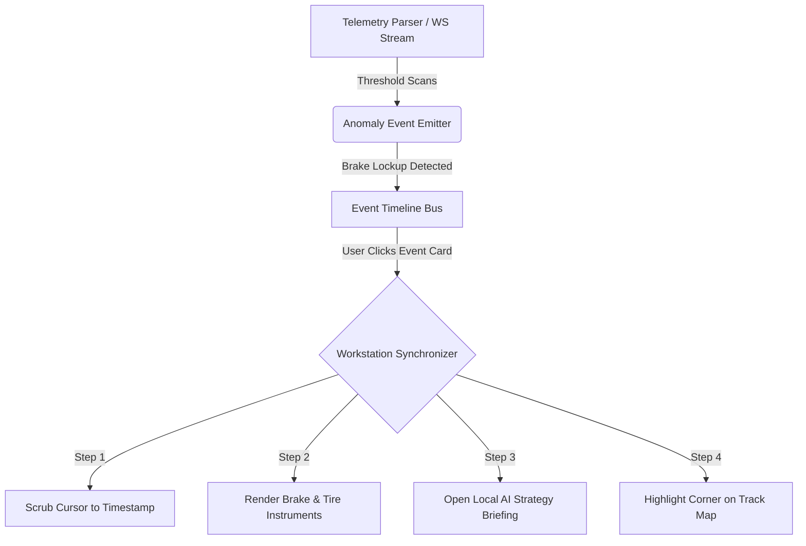

# PIT WALL — TELEMETRY OPERATING ENVIRONMENT BLUEPRINT
## Next-Generation Motorsport Workstation Architecture

This document establishes the technical blueprint for the next phase of Pit Wall's evolution from a telemetry dashboard into an elite, industrial-grade **Motorsport Telemetry Operating System**. 

---

## 1. Instrument State Bus (`useTelemetryRuntimeStore`)

To prevent prop-drilling, state fragmentation, and synchronization lag across high-frequency 60Hz and replay components, we propose a centralized Zustand-powered runtime state bus.

```typescript
import { create } from "zustand";

export interface TelemetryEvent {
  id: string;
  timestampSec: number;
  label: string;
  category: "dynamics" | "thermal" | "hybrid" | "inputs";
  severity: "info" | "warning" | "critical";
  description: string;
  associatedChannels: string[];
  cornerNumber?: number;
  metadata?: Record<string, number>;
}

export type FocusMode = "none" | "brakes" | "ers" | "chassis" | "tires" | "inputs";

interface TelemetryRuntimeState {
  // Playback / Replay States
  cursorTick: number;
  activeLap: number | null;
  playbackSpeed: number;
  isPlaying: boolean;
  
  // Workspace Composition
  activePreset: "gt3" | "gtp" | "coach" | "aero";
  selectedInstrument: "brakes" | "ers" | "chassis" | "tires" | "inputs" | null;
  
  // Event Timeline
  events: TelemetryEvent[];
  activeEvent: TelemetryEvent | null;
  
  // Calibrated Visual Filters
  focusMode: FocusMode;
  
  // Actions
  setCursorTick: (tick: number) => void;
  setActiveLap: (lap: number | null) => void;
  setPlaybackSpeed: (speed: number) => void;
  setPlaying: (playing: boolean) => void;
  setActivePreset: (preset: "gt3" | "gtp" | "coach" | "aero") => void;
  selectInstrument: (instrument: "brakes" | "ers" | "chassis" | "tires" | "inputs" | null) => void;
  
  // Event Timeline Actions
  addEvent: (event: Omit<TelemetryEvent, "id">) => void;
  triggerEvent: (event: TelemetryEvent) => void;
  clearEvents: () => void;
  
  // Focus Mode Actions
  setFocusMode: (mode: FocusMode) => void;
}

export const useTelemetryRuntimeStore = create<TelemetryRuntimeState>((set, get) => ({
  cursorTick: 0,
  activeLap: null,
  playbackSpeed: 1,
  isPlaying: false,
  activePreset: "gt3",
  selectedInstrument: null,
  events: [],
  activeEvent: null,
  focusMode: "none",

  setCursorTick: (tick) => set({ cursorTick: tick }),
  setActiveLap: (lap) => set({ activeLap: lap }),
  setPlaybackSpeed: (speed) => set({ playbackSpeed: speed }),
  setPlaying: (playing) => set({ isPlaying: playing }),
  setActivePreset: (preset) => set({ activePreset: preset }),
  selectInstrument: (instrument) => set({ selectedInstrument: instrument }),
  
  addEvent: (event) => set((state) => ({
    events: [...state.events, { ...event, id: crypto.randomUUID() }]
  })),
  
  triggerEvent: (event) => {
    // Central Orchestration Trigger (Contextual Linking)
    set({ activeEvent: event, cursorTick: Math.round(event.timestampSec * 60) });
    
    // Automatically switch active workspace preset matching event category
    if (event.category === "inputs") {
      set({ activePreset: "coach", selectedInstrument: "inputs" });
    } else if (event.category === "thermal") {
      set({ activePreset: "gt3", selectedInstrument: "tires" });
    } else if (event.category === "hybrid") {
      set({ activePreset: "gtp", selectedInstrument: "ers" });
    } else if (event.category === "dynamics") {
      set({ activePreset: "aero", selectedInstrument: "chassis" });
    }
  },
  
  clearEvents: () => set({ events: [], activeEvent: null }),
  setFocusMode: (mode) => set({ focusMode: mode }),
}));
```

---

## 2. Event Timeline Intelligence System

Instead of simple static message feeds, the **Event Timeline** acts as an operational log of physical telemetry incidents. Selecting any incident programmatically updates the entire workstation's coordinate space.



### Incident Anomaly Engine Scanners:
1. **Lockup Scanner**: Fires when `Brake` > 0.82 and wheel speed delta exceeds 15% under deceleration.
2. **ERS Saturation Scanner**: Fires when MGU-K deploy remains at max kW longer than 4.5 seconds.
3. **Throttle Stability Scanner**: Tracks steering rate of change alongside rapid throttle pumping on corner exit.

---

## 3. Calibrated Visuals & Restrained Focus Modes

To maximize cognitive bandwidth during intense race cmd situations, the **Focus Mode** dimming system leverages CSS filter cascades. When a specific Focus Mode is triggered, all unrelated channels, graphs, and indicators are visually attenuated (muted to `opacity: 0.15` and desaturated).

### Focus Mode Dimming Architecture:
```css
/* Focus Mode CSS variables applied on container panels */
.workspace-focus-brakes .channel-trace:not(.ch-brake):not(.ch-speed):not(.ch-yaw) {
  opacity: 0.12;
  filter: grayscale(80%);
  transition: all 0.3s cubic-bezier(0.16, 1, 0.3, 1);
}

.workspace-focus-brakes .telemetry-instrument:not(.instrument-brakes) {
  opacity: 0.18;
  filter: blur(0.5px);
  pointer-events: none;
}
```

---

## 4. Workstation Restraint and Visual Constraints

Elite, professional race engineering tools communicate their value through **density, mechanical calibration, and absolute visual restraint**. 

```
┌────────────────────────────────────────────────────────────────────────┐
│ [GT3 WORKSPACE]  SPEED: 184 KPH  GEAR: 4  Δ: -0.145s   [SYS: ACTIVE]   │
├────────────────────────────────┬───────────────────────────────────────┤
│ CHANNELS                       │stacked rolling channel traces         │
│ -----------------------------  │                                       │
│ LFbrakeLinePress: 64.2 Bar [x] │(TraceStack - High Contrast 60Hz Wave) │
│ RFbrakeLinePress: 64.8 Bar [x] │───────────────────────────────────────│
│ YawRate: 1.4 rad/s         [x] │                                       │
│                                │                                       │
├────────────────────────────────┴───────────────────────────────────────┤
│ INSTRUMENTS GRID                                                       │
│ ┌──────────────────────┐ ┌──────────────────────┐ ┌──────────────────┐ │
│ │ BRAKE INSTRUMENT     │ │ TIRE INSTRUMENT      │ │ INPUT INSTRUMENT │ │
│ │ FL Temp: 320°C       │ │ FL Carcass: 82°C     │ │ THR: [====   ]   │ │
│ │ FR Temp: 350°C       │ │ FR Carcass: 94°C     │ │ BRK: [==     ]   │ │
│ │ Bias Target: 82%     │ │ Grip vector: 1.8G    │ │ Smoothness: 94%  │ │
│ └──────────────────────┘ └──────────────────────┘ └──────────────────┘ │
└────────────────────────────────────────────────────────────────────────┘
```

### Visual Integrity Rules:
*   **Color as Data**: No decorative gradients. Accents are strictly functional (e.g. Red is solely for thermal overheat/extreme line pressure, Purple is solely for ERS charge/deploy cycles).
*   **High-Density Grid Layouts**: Maintain hard-edged structural panels with thin `#1C2430` borders and 0px–4px corner radii.
*   **Mechanical Readouts**: Numerical figures must use monospace fonts (e.g., `Geist Mono` or `IBM Plex Mono`) and enforce tabular alignment (`font-variant-numeric: tabular-nums`).
*   **Non-Intrusive Motion**: Animations are strictly utility-driven (real-time 60Hz signal traces, G-G grip coordinates updating, alert alarms flashing). Decorative sliding animations or complex card transitions are prohibited.
